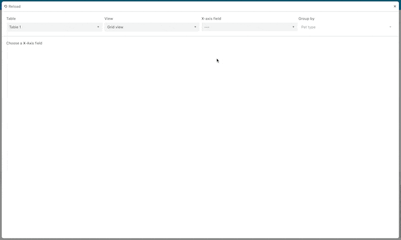

# Airtable Bar Chart Viewer

This example app shows how to intetgrate a charting library (Chart.Js) with Airtable blocks. The code shows:

- How to use the [Chart.js external library](https://www.chartjs.org/).
- How to store app-related data using [`globalConfig`](https://www.airtable.com/developers/apps/api/models/GlobalConfig) and [`Synced` UI components](https://www.airtable.com/developers/apps/api/UI/components/SelectSynced).
- How to use [Standard UI components](https://www.airtable.com/developers/apps/api/UI/components/Select) for custom behavior.
- How to implement custom hook wrappers around logically grouped Airtable features.

The application lets a user view a simple bar chart or a stacked chart based on a "grouping" select input.

## Code organization

The application relevant code lives in two directories:

`/config`: All globally defined store keys and constants.
`/frontend`: The React code that runs our application interface.

## See the app running



## How to run this app (_Theoretical_)

_First, ensure you have the [Airtable CLI installed](https://www.npmjs.com/package/@airtable/blocks-cli)._

1. _Setup_
   Create a new base with at least two columns of data with a many-to-one cardinality, i.e. one `Pet Owner` has many `Pets`.

   The data in this screenshot is as follows:

   ```tsv
   N	Person		Pet type
   1	Alice		Cat
   2	Bob 		Dog
   3	Alice		Hamster
   4	Bob		Hamster
   5	Alice		Dog
   ```

2. **Get the code and install Dependencies**
   Clone this repository to a location on your computer.
   Install dependencies from the root of your application with either `npm install` or `yarn` if you prefer.
3. **Get App ID and Block ID**
   From your base, click "add new App", when provided the `init` script, copy the app id and block id.
   **In the video below, this appears as the string value `appd9dkdYZyub62Hy/blkWKm2JYQM2l769Z`.**
4. **Update Code reference**
   In your code editor, update the config in `.block/remote.json` with the appropriate values.
5. **Run the block locally**
   From the root of your new app, run `block run`. Note the provided server where your app is located. Typically `https://localhost:9000`.
   _Note, you may need to set a Chrome configuration to allow accessing https of unverified or expired urls - localhost in our case._
6. **Provide running block endpoint to Airtable**
   Return to the browser and provide the URL of the running block.

View the following gif for a visual walk-through.


